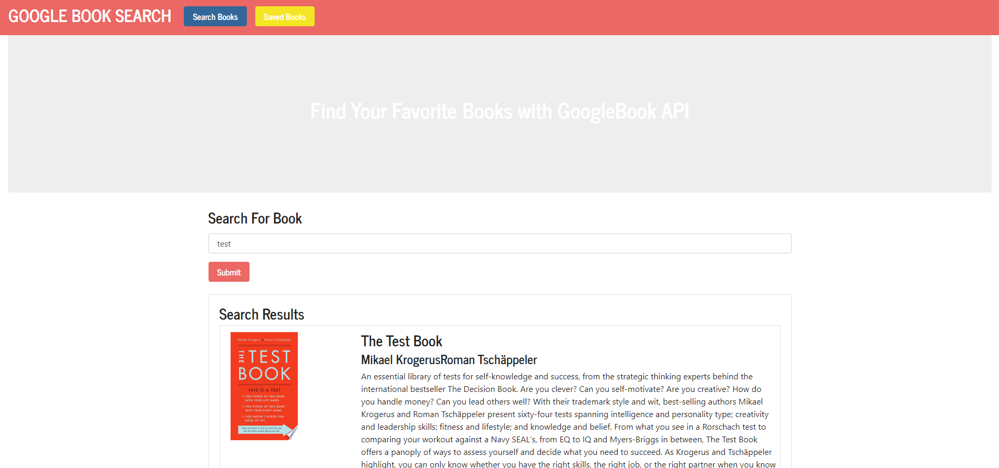

### Project Name 
# React Book App 

## Description
A simple app for saving a reading list from the google books api  
## Table of Contents  
- [Description](#description)
- [Installation](#installation)
- [Usage](#usage)

- [License](#license) 
## Media
  
## Installation  
Clone and run npm install
## Usage
Seach a book, save a book, delete a book

## License
This application is covered under the AGPLv3 license.

